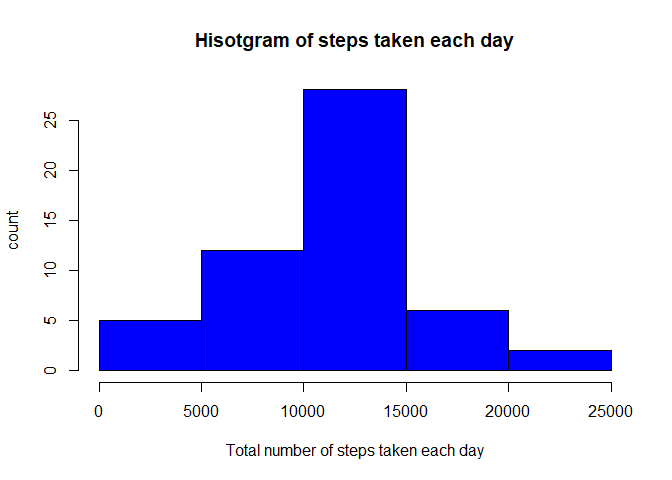
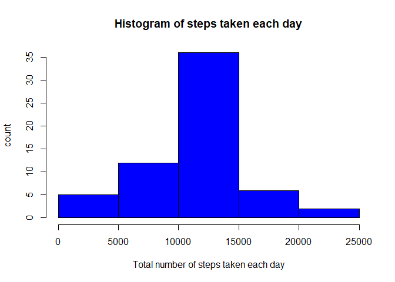
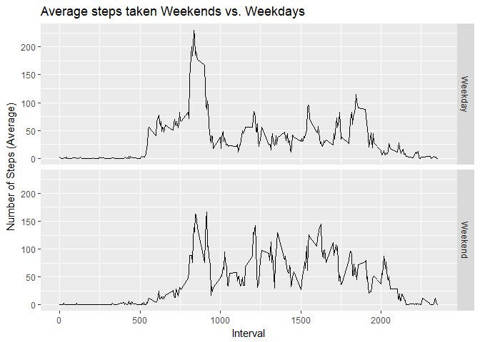

## Loading and preprocessing the data
The data, activity.csv contains data from a personal activity monitoring device. This device collects data at 5 minute intervals through out the day.
download the activity.zip and extract the content to working directory.

The data contains NA values. The code below reads the data into activity
dataset and creates two copies, activity_original and activity_na_filled.


```r
library(dplyr)
```

```
## 
## Attaching package: 'dplyr'
```

```
## The following objects are masked from 'package:stats':
## 
##     filter, lag
```

```
## The following objects are masked from 'package:base':
## 
##     intersect, setdiff, setequal, union
```

```r
library(ggplot2)
```

```
## Warning: package 'ggplot2' was built under R version 3.4.4
```

```r
# Read activity data. from current directory
activity <- read.csv(file=".\\activity.csv", header=TRUE, sep=",")

# copy the data to other variables for reference.
activity_original <- activity  # this will remain unchanged
activity_na_filled <- activity # this data set will have NA's replaced later on

# Remove NA values from data. activiy data set contains NA, remove all NA for further analysis
activity<-activity[which(is.na(activity$steps)==FALSE),]
```

## What is mean total number of steps taken per day?
Use aggregate function grouped by date to sum all the steps taken per day and store the results in steps_per_day dataset.


```r
#Calculate the total number of steps taken per day
steps_per_day <-aggregate( x =activity$steps,
                           by=list(Day=activity$date),
                           FUN = sum
                )

#Label the result columns
names(steps_per_day)<- c("day", "total_steps")

#Total number of steps taken per day
steps_per_day
```

```
##           day total_steps
## 1  2012-10-02         126
## 2  2012-10-03       11352
## 3  2012-10-04       12116
## 4  2012-10-05       13294
## 5  2012-10-06       15420
## 6  2012-10-07       11015
## 7  2012-10-09       12811
## 8  2012-10-10        9900
## 9  2012-10-11       10304
## 10 2012-10-12       17382
## 11 2012-10-13       12426
## 12 2012-10-14       15098
## 13 2012-10-15       10139
## 14 2012-10-16       15084
## 15 2012-10-17       13452
## 16 2012-10-18       10056
## 17 2012-10-19       11829
## 18 2012-10-20       10395
## 19 2012-10-21        8821
## 20 2012-10-22       13460
## 21 2012-10-23        8918
## 22 2012-10-24        8355
## 23 2012-10-25        2492
## 24 2012-10-26        6778
## 25 2012-10-27       10119
## 26 2012-10-28       11458
## 27 2012-10-29        5018
## 28 2012-10-30        9819
## 29 2012-10-31       15414
## 30 2012-11-02       10600
## 31 2012-11-03       10571
## 32 2012-11-05       10439
## 33 2012-11-06        8334
## 34 2012-11-07       12883
## 35 2012-11-08        3219
## 36 2012-11-11       12608
## 37 2012-11-12       10765
## 38 2012-11-13        7336
## 39 2012-11-15          41
## 40 2012-11-16        5441
## 41 2012-11-17       14339
## 42 2012-11-18       15110
## 43 2012-11-19        8841
## 44 2012-11-20        4472
## 45 2012-11-21       12787
## 46 2012-11-22       20427
## 47 2012-11-23       21194
## 48 2012-11-24       14478
## 49 2012-11-25       11834
## 50 2012-11-26       11162
## 51 2012-11-27       13646
## 52 2012-11-28       10183
## 53 2012-11-29        7047
```
   
Now, plot a histogram of the total number of steps taken each day using hist function

```r
        hist(
                x=steps_per_day$total_steps,
                col="blue",
                xlab="Total number of steps taken each day",
                ylab="count",
                main="Hisotgram of steps taken each day"
        )
```

<!-- -->

Calculate and report the mean and median of the total number of steps taken per day

```r
mean_steps_per_day <- mean(steps_per_day$total_steps)
median_steps_per_day <- median(steps_per_day$total_steps)

#The mean of total steps taken per day is 
mean_steps_per_day
```

```
## [1] 10766.19
```

```r
#The median of total steps taken per day is
median_steps_per_day
```

```
## [1] 10765
```


## What is the average daily activity pattern?
Using aggregate function, calculate the mean of steps taken per interval across all days in the data set and
store in interval_average_step dataset


```r
interval_average_step<-aggregate(x = activity$steps, by = list(interval=activity$interval), FUN = mean)

#Name the columns
names(interval_average_step) <- c("interval","average_steps")

head(interval_average_step)
```

```
##   interval average_steps
## 1        0     1.7169811
## 2        5     0.3396226
## 3       10     0.1320755
## 4       15     0.1509434
## 5       20     0.0754717
## 6       25     2.0943396
```

Now, make the plot of 5 minute intervaland the average number of steps using plot function


```r
plot(interval_average_step$interval, interval_average_step$average_steps, 
             type="l",
             xlab="Interval",
             ylab="Average steps taken",
             main="Average steps taken during 5 minute interval")
```

<!-- -->

using the dataset above, find the 5-minute interval that contains the maximum number of steps. which.max is used for the same.

```r
interval_with_max_steps <- interval_average_step$interval[which.max(interval_average_step$average_steps)]  

#The interval with maximum number of steps is 
interval_with_max_steps
```

```
## [1] 835
```

## Imputing missing values
There are a few missing values in the source data.
The activity_original dataset contains the original data, Let's use it to find the total number of missing
entries


```r
missing_entries <-length(which(is.na(activity_original$steps)==TRUE))

#The number of missing entries in data
missing_entries
```

```
## [1] 2304
```


Now, let's put the mean for that 5 minute interval (rounded to integer) as the number of steps, where ever
the value is missing. The below code does that for us


```r
        for (i in 1:nrow(activity_na_filled)) {
                if (is.na(activity_na_filled$steps[i])) {
                        # Find the index value for when the interval matches the average
                        index <- which(activity_na_filled$interval[i] == interval_average_step$interval)
                        # Assign the value to replace the NA
                        activity_na_filled$steps[i] <- round(interval_average_step[index,]$average_steps)
                }
        }
```

The new dataset created with all missing data filled in is activity_na_filled. A few entries from new data set is as below 


```r
head(activity_na_filled)
```

```
##   steps       date interval
## 1     2 2012-10-01        0
## 2     0 2012-10-01        5
## 3     0 2012-10-01       10
## 4     0 2012-10-01       15
## 5     0 2012-10-01       20
## 6     2 2012-10-01       25
```

Use the new dataset, activity_na_filled to calculate
the mean and median of total number of steps per day


```r
na_filled_steps_per_day <-aggregate(x = activity_na_filled$steps, by = list(Day=activity_na_filled$date), FUN = sum)

# Label the result columns
names(na_filled_steps_per_day)<- c("day", "total_steps")

na_filled_mean_steps_per_day <- mean(na_filled_steps_per_day$total_steps)

na_filled_median_steps_per_day <- median(na_filled_steps_per_day$total_steps)

#The mean of total steps taken per day after adding missing value is
na_filled_mean_steps_per_day
```

```
## [1] 10765.64
```

```r
#The median of total steps taken per day after adding missing value is
na_filled_median_steps_per_day
```

```
## [1] 10762
```

####After imputing missing data on the estimates of the total daily number of steps,the mean value remains more or less same, but the median got lower.


Plot a histogram with missing data replaced as per above

```r
hist(
                        x=na_filled_steps_per_day$total_steps,
                        col="blue",
                        xlab="Total number of steps taken each day",
                        ylab="count",
                        main="Histogram of steps taken each day"
                )
```

<!-- -->
        


## Are there differences in activity patterns between weekdays and weekends?

To find the patterns on weekdays and weekends, add dayofweek column to existing dataset,activity_na_filled.
Use weekdays function to achieve the desired result


```r
activity_na_filled$date <- as.Date(activity_na_filled$date)
                
activity_na_filled$dayofweek <-sapply(weekdays(activity_na_filled$date), switch, 
                  Monday = "Weekday", 
                  Tuesday = "Weekday", 
                  Wednesday = "Weekday", 
                  Thursday = "Weekday",
                  Friday = "Weekday",
                  Saturday = "Weekend",
                  Sunday = "Weekend"
                  )

head(activity_na_filled)
```

```
##   steps       date interval dayofweek
## 1     2 2012-10-01        0   Weekday
## 2     0 2012-10-01        5   Weekday
## 3     0 2012-10-01       10   Weekday
## 4     0 2012-10-01       15   Weekday
## 5     0 2012-10-01       20   Weekday
## 6     2 2012-10-01       25   Weekday
```

Find the average number of steps averaged across all weekdays and weekends


```r
dayaverage <- activity_na_filled %>%
        group_by(dayofweek, interval) %>%
        summarize(AverageSteps=mean(steps))
     
head(dayaverage)
```

```
## # A tibble: 6 x 3
## # Groups:   dayofweek [1]
##   dayofweek interval AverageSteps
##   <chr>        <int>        <dbl>
## 1 Weekday          0       2.29  
## 2 Weekday          5       0.4   
## 3 Weekday         10       0.156 
## 4 Weekday         15       0.178 
## 5 Weekday         20       0.0889
## 6 Weekday         25       1.58
```
 
do the panel plot using qplot

```r
qplot(interval, AverageSteps, data=dayaverage,
      type="l",
      geom="line",
      xlab="Interval",
      ylab="Number of Steps (Average)",
      main="Average steps taken Weekends vs. Weekdays",
      facets =dayofweek ~ .) 
```

```
## Warning: Ignoring unknown parameters: type
```

<!-- -->

As seen in the plots, the activity starts earlier on weekdays than on weekends and the average numer of steps shows an increase in the initial few intervals during weekdays
